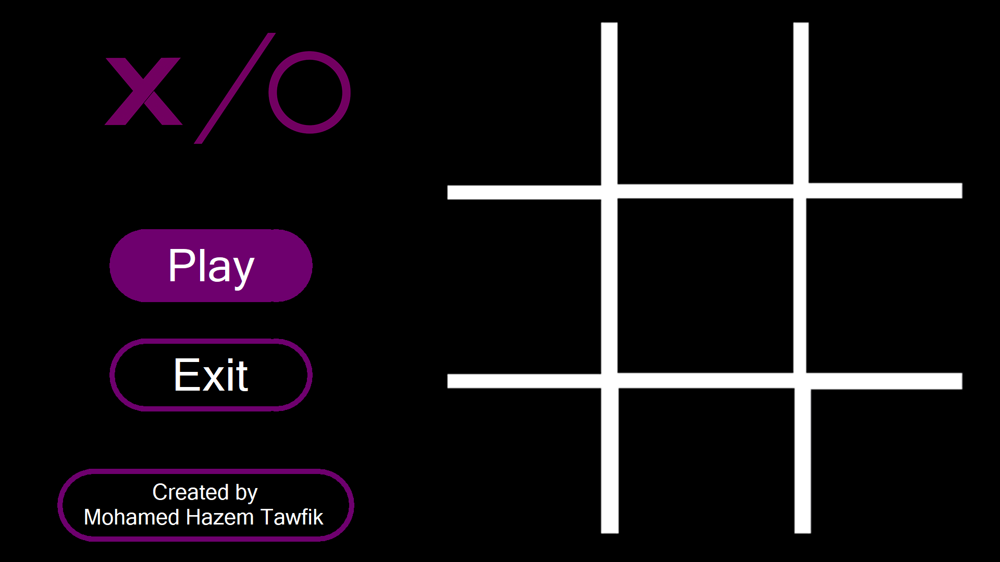
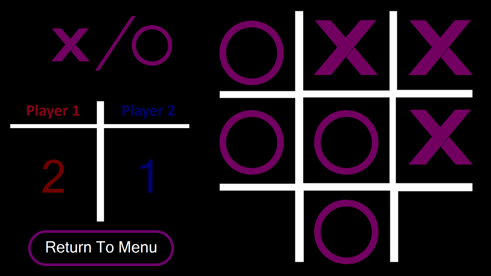
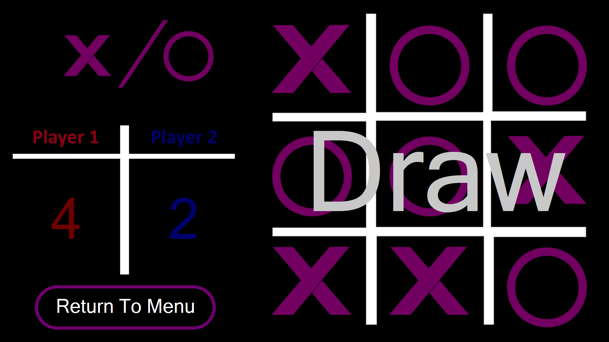

# 🎮 Tic Tac Toe (C++ with CC212SGL)

A modern **Tic Tac Toe** game built in **C++** with **fancy graphics on the command line** using the `CC212SGL` graphics library.  
The project demonstrates **Object-Oriented Programming (OOP)** principles, the use of **data structures**, and **algorithmic logic** to handle game conditions and rendering.

---

## ✨ Features
- 🖼️ **Custom Graphics in CMD** (using `CC212SGL`)
- ♟️ **Player vs Player** Tic Tac Toe
- 🧠 Uses **Data Structures & Algorithms** to manage game states and win conditions
- 🎯 **Object-Oriented Design** for clean, modular code
- 🔒 **Disabled CMD Interactions** to prevent unwanted interference with the graphics

---

## ⚙️ Requirements
- C++17 or later
- [CC212SGL Graphics Library](#) (make sure it is installed/configured)
- Windows Command Prompt (tested environment)

## 📷 Screenshots

### Game Board


### Player Wins


### Draw Screen


---

## 🚀 Build & Run

Clone the repository:
```bash
git clone https://github.com/The-Mastermind-of-this-gen/Tic_Tac_Toe.git
cd Tic_Tac_Toe

g++ -std=c++17 main.cpp -o TicTacToe -lCC212SGL
Run the game
./TicTacToe
```


---

## 🛠️ Technologies Used
- **C++17**
- **CC212SGL** (custom graphics library)
- **Data Structures & Algorithms**
- **Object-Oriented Programming**

---

## 🤝 Contributing
Contributions, issues, and feature requests are welcome!  
Feel free to fork this repo and submit a pull request.
